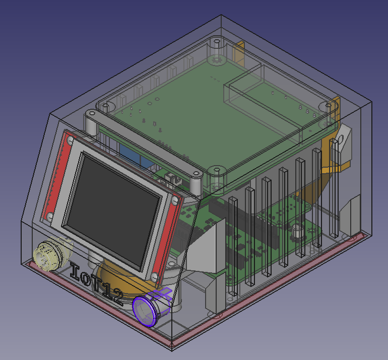

# Hi!

This is an attempt at creating a soldering iron controller that uses T12 tips for a soldering iron handle with GX12-5 connector (KSGER FX9501 Handle). The pinout of the GX12-5 connector should match [this table](#control-board-j5-to-gx12-5-connector).

The name IoT12 is a portmanteau of IoT (because this soldering iron controller is connected to the internet using WiFi) and T12 (the type of soldering iron tip).

Have a look at the different elements that make up this project:

- [3d models for the case](3d/)
- [firmware for the heat controller and main processor](firmware/)
- [schematic and pcb](hardware/)

# Status

**Experimental and incomplete. Do not replicate yet.**

**You should be present at all times when using this project in case something goes wrong.**

# Assembly

You will need to 3d print all the parts mentioned in [3d](3d/README.md) directory.

You will need the 3 PCBs mentioned in the [hardware](hardware/README.md) directory.

# Cable harness

You need to crimp some JST-XH connectors and an IDC cable. Except for the IDC cable, use a wire diameter that can carry 3A. I used 0.2mm² (24 AWG, RS PRO series stranded tinned copper conductor equipment wire with PVC insulation).

## Power supply J2 to power switch

Cut 2 pieces of 14cm (5 33/64 inch) wire and crimp JST-XH pin on 1 end. Then plug into JST-XHP-2 connector. Solder the other end to a 16mm round rocker switch.

| Pin   | Description       | Wire color    |
| --:   | --                | --            |
| 1     | To power switch   | Purple        |
| 2     | To power switch   | Purple        |

## Power supply J3 to Control Board J4

Cut 4 pieces of 14cm wire and crimp JST-XH pin on both ends. Then plug into JST-XHP-4 connector.

| Pin   | Description   | Wire color    |
| --:   | --            | --            |
| 1     | +24V          | Yellow        |
| 2     | +5V           | Red           |
| 3     | GND           | Black         |
| 4     | +24V ON       | Pink          |

## Control board J2 to speaker

Cut 2 pieces of 14cm wire and crimp JST-XH pin on 1 end. Then plug into JST-XHP-2 connector. Solder the other end to a 4cm speaker (4 ohm 3 watt)

| Pin   | Description       | Wire color    |
| --:   | --                | --            |
| 1     | To speaker        | Brown         |
| 2     | To speaker        | Brown         |

## Control board J5 to GX12-5 connector

Cut 5 pieces of 14cm wire and crimp JST-XH pin on 1 end. Then plug into JST-XHP-52 connector. Solder other end to GX12-5 connector.

| Pin   | Description       | Wire color    |
| --:   | --                | --            |
| 1     | shake             | Blue          |
| 2     | NTC               | White         |
| 3     | ESD               | Green         |
| 4     | T12-              | Black         |
| 5     | T12+              | Red           |

## Control board J1 to Display Adapter J1

Cut a 14 cm 14-pin 1.27mm pitch ribbon cable. Crimp a IDC-14 connector on both ends. You should orient both connectors so that one polarizing key points away from the center of the cable and the other points to the center of the cable. Please note that pin 1 of the cable should align with pin 1 on both connectors (indicated by a triangle on the connector).

# Testing

Connect a (KSGER) T12 solder iron handle with the T12 tip (really) firmly seated inside to the GX12-5 socket. The JST-XH connector should connected to the control pcb. The power supply board should be connected to to the control pcb, but not powered on.

Measure about 60kΩ between the tip of the iron and GND on the control board (J6).

Measure 1MΩ between the tip of the iron and EARTH pin at the Power supply board (J1).

Now measure some values at the solder iron connector J5.\
The heater resistor between 4 (black) and 5 (red): 8Ω.\
Not 8Ω? Now retry and really push in the T12 tip into the handle.

Switch over to measure mV and measure 4 (black) and 5 (red) again. When you have not touched the handle and tip for half an hour you should read 0mV. Grab the cold T12 tip with your hand. You should notice an increasing voltage, possibly a rise until 0.1mV. It is possible your voltmeter is not capable of measuring in the microvolt range. You can heat the tip with a flame for a few seconds to increase the voltage some more.

Measure the NTC between 4 (black) and 2 (white): 5KΩ at 22°C (71.6°F) room temperature, but resistance could vary slightly when not measuring at 22°C.

Test the tilt sensor. Point soldering iron up and measure between 1 (blue) and 3 (green). You are measuring around 250kΩ.\
Point iron down and measure a low resistance of less than 100Ω.

The soldering iron handle is now validated to be correctly connected and should function correctly.

Connect the speaker to J2 on the control board.

Connect the power switch to J2 on the power supply board.

Connect display adapter J1 to control board J1.

Modules A1 and A3 should not be plugged in yet. All other connectors are plugged in.

Apply current limited (100mA) 24V with your lab power supply to the right leg of F1 on the power supply board (and gnd on some other pin like the middle pin of U1). Apply the 24V slowly starting at 0V. Stop at 6V. Measure the 5V pin on J4 (it should be 5.2V), notice LED D4 also lit up. Continue increasing to 24V. Current should stay below 10mA. Turn off lab power supply.

When all tests went well flash [the firmware](firmware/README.md) to both A1 (ESP32) and A3 (SAMD21). Do not plug in the modules in the control board before flashing the firmware.

Plug in A1 and A3. Both USB connectors should point to the center of the control board.
Again apply current limited 24V. But now increase the limit to 250mA. At about 6V the display should turn on. Both blue LEDs on A3 and the red LED on A3 should also light up. Current is now about 200mA. Increase until 24V. Current is now about 60mA.\
Measure the 3V3 pin on J6, it should measure 3.3V.

If your power supply can handle 3.5A at 24V you could try enable heating of the soldering iron. To enable heating you must switch on the power switch connected to J2 on the power supply board.

If you came this far and all tests went well, go reward yourself with your favorite drink or snack. Happy.

# Final assembly

\<insert final assembly instructions here, something about fitting everything in the 3d printed case, hmm, maybe this is all the instuctions needed>

